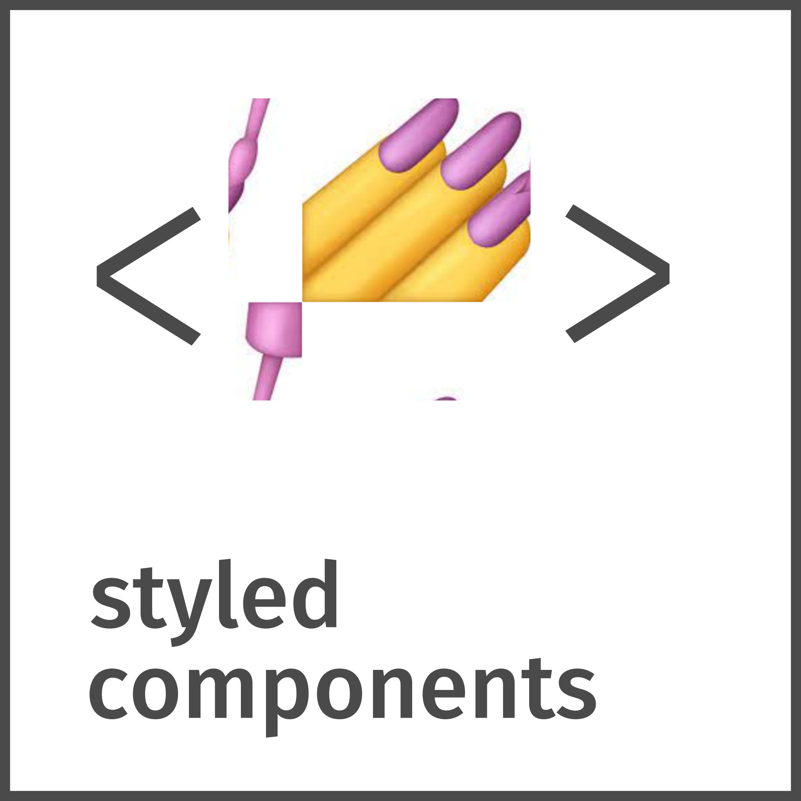

<h1>Hey , I'm Gabriel</h1>
<h3>A Front-End Developer with experience in building responsive, accessible websites and web applications.</h3>

## About me:

:computer: Studying Analysis and Systems Development

:books: Currently studying React, NextJs and TypeScript

:video_game: I love videogames and movies

## Languages and Tools:

## Connect with me:

